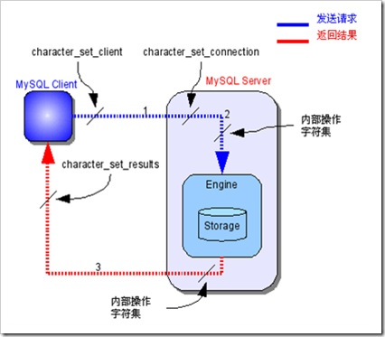

#### 1、给你四个坐标点，判断它们能不能组成一个矩形，如判断([0,0],[0,1],[1,1],[1,0])能组成一个矩形。
    设四点(x0, y0), (x1, y1), (x2, y2), (x3, y3)
    只要计算三个内角都是直角就可以推导出这四点组成一个矩形
    也就是判断相邻的边正交，即相邻边的边矢量点积为0
    (x3-x0)*(x1-x0)+(y3-y0)*(y1-y0) == 0 (以(x0, y0)为顶点的角)
    且
    (x0-x1)*(x2-x1)+(y0-y1)*(y2-y1) == 0 (以(x1, y1)为顶点的角)
    且
    (x1-x2)*(x3-x2)+(y1-y2)*(y3-y2) == 0 (以(x2, y2)为顶点的角)
    
    点积的值
    u的大小、v的大小、u,v夹角的余弦。在u,v非零的前提下，点积如果为负，则u,v形成的角大于90度；如果为零，那么u,v垂直；如果为正，那么u,v形成的角为锐角。

    
    @lzylyd提供了通过斜率求两条边是否垂直的方式(https://baike.baidu.com/item/%E6%96%9C%E7%8E%87)
    k1 * k2 = (y1-y2)/(x1-x2) * (y2-y3)/(x2-x3) = -1
    

#### 2、写一段代码判断单向链表中有没有形成环，如果形成环，请找出环的入口处，即P点 
    class Node{
        public $data=null;
        public $next=null;
    }
    
    function eatList(Node $node) {
        $fast = $slow = $node;
        $first_target = null;
        if($node->data == null) {
            return false;
        }
    
        while (true) {
            if($fast->next != null && $fast->next->next != null) {
                $fast = $fast->next->next;      //快指针一次走两步
                $slow = $slow->next;            //慢指针一次走一步
            } else {
                return false;
            }
    
            if($fast == $slow) {                //慢指针追上快指针,说明有环
                $p1 = $node;                    //p1指针指向head节点,p2指针指向它们第一次相交的点,然后两个指针每次移动一步,当它们再次相交,即为环的入口
                $p2 = $fast;
                while($p1 != $p2) {
                    $p1    = $p1->next;
                    $p2    = $p2->next;
                }
                return $p1;                     //环的入口节点
            } 
        }
    }

#### 3、写一个函数，获取一篇文章内容中的全部图片，并下载
    function downImagesFromTargetUrl($url, $target_dir = null) {
        if(!filter_var($url, FILTER_VALIDATE_URL)){
            return false;
        }
        if(!$target_dir) {
            $target_dir = './download';
        }
    
        $root_url = pathinfo($url);
    
        $html = file_get_contents($url);            //主要
        preg_match_all('/]*src="([^"]*)"[^>]*>/i',$html, $matchs);   //主要
    
        $images = $matchs[1];
    
        foreach ($images as $img) {
            $img_url = parse_url($img);
            if(! array_key_exists('host', $img_url)) {
                $img_url = $root_url['dirname'] . DIRECTORY_SEPARATOR . $img;
            } else {
                $img_url = $img;
            }
    
            $img_path = array_key_exists('path', $img_url) ? $img_url['path'] : $img;
            $save = $target_dir . DIRECTORY_SEPARATOR . $img_path;
            $save_path = pathinfo($save);
    
            if(!is_dir($save_path['dirname'])) {
                mkdir($save_path['dirname'], 0777, true);
            }
    
            file_put_contents($save,file_get_contents($img_url));   //主要
        }
    }

#### 4、获取当前客户端的IP地址，并判断是否在（1.1.1.1,255.255.255.254) 
    function getip()
    {
        $unknown = 'unknown';
        if (isset($_SERVER['HTTP_X_FORWARDED_FOR']) && $_SERVER['HTTP_X_FORWARDED_FOR'] && strcasecmp($_SERVER['HTTP_X_FORWARDED_FOR'], $unknown)) {
            $ip = $_SERVER['HTTP_X_FORWARDED_FOR'];
        } elseif (isset($_SERVER['REMOTE_ADDR']) && $_SERVER['REMOTE_ADDR'] && strcasecmp($_SERVER['REMOTE_ADDR'], $unknown)) {
            $ip = $_SERVER['REMOTE_ADDR'];
        }
        /*
        处理多层代理的情况
        或者使用正则方式：$ip = preg_match("/[\d\.]{7,15}/", $ip, $matches) ? $matches[0] : $unknown;
        */
        if (false !== strpos($ip, ','))
            $ip = reset(explode(',', $ip));
        return $ip;
    }
    
    $client_ip = getip();
    $client_ip = sprintf('%u', ip2long($client_ip));   //64位系统无压力
    
    /**
     * plan A
     */
    $range_min = sprintf('%u', ip2long('1.1.1.1'));
    $range_max = sprintf('%u', ip2long('255.255.255.255'));
    
    /**
     * plan B
     */
    $range_min = bindec(decbin(ip2long('1.1.1.1')));
    $range_max = bindec(decbin(ip2long('255.255.255.255')));
    
    
    if ($client_ip >= $range_min and $client_ip <= $range_max) {
        echo 'true';
    } else {
        echo 'false';
    }
#### 5、nginx的log_format配置如下： 
    log_format  main  '$remote_addr - $remote_user [$time_local] "$request" '
                           '$upstream_response_time '
                           '$status $body_bytes_sent "$http_referer" '
                           '"$http_user_agent" "$http_x_forwarded_for"';
                           
从今天的nginx log文件 access.log中：
* a、列出"request_time"最大的20行？ 
* b、列出早上10点访问量做多的20个url地址？

    a: cat /usr/local/var/log/nginx/access.log|sort -nrk9|head -2
    
    b: grep "07/May/2018:10:" /usr/local/var/log/nginx/access.log|awk '{print $12}'|sort -rn|uniq -c|head -20
    
			
#### 6、什么是CSRF攻击？XSS攻击？如何防范？
    CSRF:https://baike.baidu.com/item/CSRF/2735433
    防范方式: CSRF TOKEN, 即提交表单时同时提交一段由服务端渲染表单时生成的token,通过校验token来防范csrf攻击
    
    XSS:https://baike.baidu.com/item/xss/917356
    简单来说,XSS就是正常页面执行了用户或黑客提交的前端代码,比如你用了eval('这里执行了用户提交的代码'),
    或者你的页面正常解析了用户提交的html代码,如用户提交的个人信息是:,
    而你不加过滤转义就入库,然后页面正常解析html代码,最终用户访问这个页面就会跳转到恶意网站 ,这就是XSS
    防范方式: 过滤&&转义用户输入(如htmlentities、htmlspecialchars),永久不要信任客户端
    
    

#### 7、应用中我们经常会遇到在user表随机调取10条数据来展示的情况，简述你如何实现该功能。

    select * from user where rand() limit 10;

#### 8、从扑克牌中随机抽5张牌，判断是不是一个顺子,即这5张牌是连续的,JQK用11、12、13表示
    
    我的理解: 既然是顺子,那么肯定没有对子,找到最小的值后,顺序加1看是否存在,如果都存在,则为顺
    如果我写的话是这样:
    function eatChicken(arr $data)
    {
        $min = min($data);
        for ($i = $min; $i < $min + 5; ++$i) {
            if (!in_array($i, $data)) {
                return false;
            }
        }
        return true;
    }
    
    var_dump(eatChicken([1, 3, 5, 2, 4]));
    var_dump(eatChicken([10, 13, 11, 12, 14]));
    var_dump(eatChicken([1, 3, 5, 7, 9]));
    
    https://github.com/hookover/php-engineer-interview-questions/issues/8
    @johson
    function eatDuck(array $arr)
    {
        $count = count($arr);
        if (count(array_unique($arr)) != $count) {
            return false;//对子
        }
        if (max($arr) - min($arr) != $count - 1) {
            return false;
        }
        return true;
    }
    var_dump(eatDuck([1, 3, 5, 2, 4]));
    var_dump(eatDuck([10, 13, 11, 12, 14]));
    var_dump(eatDuck([1, 3, 5, 7, 9]));

    有更好方法请补充,大神们来个不用内置函数的版本
    
#### 9、两条相交的单向链表，如何求它们的第一个公共节点
    第二题

#### 10、最长公共子序列问题LCS，如有[1,2,5,11,32,15,77]和[99,32,15,5,1,77]两个数组，找到它们共同都拥有的数，写出时间复杂度最优的代码，不能用array_intersect（这里有坑，需要去研究一下动态规划）。 
    A * "1+1+1+1+1+1+1+1 =？" *
    
    A : "上面等式的值是多少"
    B : *计算* "8!"
    
    A *在上面等式的左边写上 "1+" *
    A : "此时等式的值为多少"
    B : *quickly* "9!"
    A : "你怎么这么快就知道答案了"
    B : "只要在8的基础上加1就行了"
    A : "所以你不用重新计算因为你记住了第一个等式的值为8!动态规划算法也可以说是 '记住求过的解来节省时间'"

    https://blog.csdn.net/u013309870/article/details/75193592 （我觉得原理讲得最好）
    https://www.cnblogs.com/zlm-jessie/p/5664562.html

#### 11、linux的内存分配和多线程原理
    这个还是百度找资料吧……

#### 12、MYSQL中主键与唯一索引的区别
    主键是一种约束，唯一索引是一种索引，两者在本质上是不同的
    主键创建后一定包含一个唯一性索引，唯一性索引并不一定就是主键
    唯一性索引列允许空值，而主键列不允许为空值
    主键列在创建时，已经默认为空值 + 唯一索引了
    主键可以被其他表引用为外键，而唯一索引不能
    一个表最多只能创建一个主键，但可以创建多个唯一索引
    主键更适合那些不容易更改的唯一标识，如自动递增列、身份证号等
    在 RBO 模式下，主键的执行计划优先级要高于唯一索引。 两者可以提高查询的速度
    
    https://blog.csdn.net/baoqiangwang/article/details/4832814

#### 13、http与https的主要区别
    个基于OSI模型理解：
    http工作在应用层
    https是建立在SSL信道上的http，而SSL属于OSI模型中的传输层，所以我觉得HTTPS是属于传输层的协议
    但有同学提出了不同看法，相关讨论见：https://github.com/hookover/php-engineer-interview-questions/issues/7
    
    所以如果是基于TCP/IP模型的话：HTTP和SSL都是工作在应用层，那么HTTP和HTTPS同属应用层协议
    
    http是明文传输
    https是加密传输
    
    面试官会问到ssl数字证书,对称加密和非对称加密的区别
    
    超文本传输协议HTTP协议被用于在Web浏览器和网站服务器之间传递信息。HTTP协议以明文方式发送内容，不提供任何方式的数据加密，如果攻击者截取了Web浏览器和网站服务器之间的传输报文，就可以直接读懂其中的信息，因此HTTP协议不适合传输一些敏感信息，比如信用卡号、密码等。
    为了解决HTTP协议的这一缺陷，需要使用另一种协议：安全套接字层超文本传输协议HTTPS。为了数据传输的安全，HTTPS在HTTP的基础上加入了SSL协议，SSL依靠证书来验证服务器的身份，并为浏览器和服务器之间的通信加密。
    HTTPS和HTTP的区别主要为以下四点：
    一、https协议需要到ca申请证书，一般免费证书很少，需要交费。
    二、http是超文本传输协议，信息是明文传输，https 则是具有安全性的ssl加密传输协议。
    三、http和https使用的是完全不同的连接方式，用的端口也不一样，前者是80，后者是443。
    四、http的连接很简单，是无状态的；HTTPS协议是由SSL+HTTP协议构建的可进行加密传输、身份认证的网络协议，比http协议安全。
    
    https://baike.baidu.com/item/https

#### 14、http状态码及其含意 
    基本记住200、201、301、302、400、403、404、500、502、503就差不太多了

#### 15、linux中怎么查看系统资源占用情况,同时会问到怎么查看TCP端口,TCP连接状态
    top         //可能会问得更深,比如显示出来有哪些信息、你关心哪些信息、查看某个进程等
    iostat      //磁盘cpu
    free        //内存剩余
    df          //磁盘使用情况
    du          //文件占用信息
    
    ps              //查看进程信息
    netstat -anptol //查看端口占用情况,参数细节建议查文档,小心被问倒

#### 16、SQL注入的原理是什么？如何防止SQL注入 
    通常都是低级程序员写的低级代码,未过滤用户输入导致的,现代框架的ORM一般都做过相应处理,如果需要自己处理,有两种解决方式:
    1:转义用户输入(htmlentities/htmlspecialchars),用mysql_real_escape_string方法过滤SQL语句的参数
    2:预编译sql    (最佳方式)

#### 17、isset(null) isset(false) isset(0) isset([]) empty(0) empty(null) empty(false) empty([])输出
    你还是动手试试吧~

#### 18、优化MYSQL的方法
    个人理解: 
    需要从整个项目环境来谈优化,具体可以分为3个方面:
    硬件层面:
        采用高配sass硬盘、上磁盘阵列
    架构层面:
        分库、分区、分表、主从(主主)、多服务器集群、vip+keepalive等   (可能会问到具体实现,所以在回答前要把这些实现细节搞得差不多懂)
    应用层面(下面只要你提到,面试官都可能会问细节,比如有哪些存储引擎,各有什么区别和应用场景,innodb的主键索引和非主键索引有何区别,数据结构,叶子节点存放什么?)
        存储引擎的选择
        字段的选择
            越短越快
            定长类型快于变长类型
            整型的处理速度快于字符串类型
        索引
           MYSQL支持的索引类型 (讲到这肯定会问你具体定义)
           索引的使用条件
           索引的实现结构
               聚簇索引，聚集索引，B+Tree
               HASH索引
        慢查询日志
            可帮助找到问题语句
        通过explain来优化sql语句
          

#### 19、数据库中的事务是什么？
    事务的特征：ACID
    原子性Atomicity 一组DML语句要么全部成功要么全部失败
    一致性Consistency 事务必须由一个状态到另一个状态
    隔离性Isolation 多个事务之间能够根据事务的隔离级别表现不同
    持久性Durability 提交后的事务，一旦提交，它对数据库中的数据修改是永久性的
    
    Q:当没有事务的情况会出现什么问题?
    A:当在控制台，操作mysql数据库时候，如果没有事务控制，误操作就会造成数据的永久损失。
    

事务的隔离级别:
    
|隔离级别|脏读|不可重复读|幻读|加锁读?
|--------|-----|---------|---|---
|读未提交(Read uncommitted)|o|o|o|不加锁
|读已提交(Read committed)|x|o|o|不加锁
|可重复读(Repeatable read)|x|x|o(mysql不会出现 x)|不加锁
|可串行读(Serializable)|x|x|x|加锁 (全表锁)

    脏读：当某个客户端查询出了另外一个事务还没有提交的修改数据，即为脏读。
    不可重复读：[同一查询]在[同一事务]中多次进行，由其它提交事务所做的修改或删除，每次返回不同的的结果集，此时发生非重复读。
    幻读：[同一查询]在[同一事务]中多次进行，由于其它提交事务(事务可能没提交)所做的插入操作，每次返回不同的结果集，此时发生幻读。
    
#### 20、写一个函数，尽可能高效的从一个标准URL中取出文件的扩展名
    面试官说要高效,我记得好像用正则并不高效,那么排除正则?然后他又说了是一个"标准url",难道希望你用parse_url函数?
    那我这么写:
    $ext = array_pop(explode('.',parse_url($url)['path']));
    并不觉得高效~
    
#### 21、参数为多个日期时间的数组，返回离当前时间最近的那个时间
    我只能想到foreach方式咯,欢迎大神修改
    $data = [
        '2015-02-02 11:11:11',
        '2012-02-02 11:55:11',
        '2019-12-02 11:33:11',
        '2017-12-02 11:22:11',
    ];
    
    $near = array_reduce($data, function($a, $b){
       return abs((time() - strtotime($a))) < abs((time() - strtotime($b))) ? $a : $b;
    });
    
    echo $near;
    
#### 22、echo、print、print_r的区别 
    echo    不是函数,没有返回值,仅用于打印信息,如果只是输出 echo 会更快
    print   有返回值,是函数,还能格式化输出
    print_r 则是打印复合类型如数组 对象
    
#### 23、http协议的header中有哪些key及含义
    General
        Request URL: http://localhost/test/t.php
        Request Method: GET
        Status Code: 200 OK
        Remote Address: 127.0.0.1:80
        Referrer Policy: no-referrer-when-downgrade
    Reaponse Headers
        Connection: keep-alive
        Content-Encoding: gzip
        Content-Type: text/html; charset=UTF-8
        Date: Mon, 07 May 2018 10:05:43 GMT
        Server: nginx/1.10.1
        Transfer-Encoding: chunked
        X-Powered-By: PHP/7.0.8
    Request Headers
        Accept: text/html,application/xhtml+xml,application/xml;q=0.9,image/webp,image/apng,*/*;q=0.8
        Accept-Encoding: gzip, deflate, br
        Accept-Language: zh-CN,zh;q=0.9,en;q=0.8
        Cache-Control: no-cache
        Connection: keep-alive
        Host: localhost
        Pragma: no-cache
        Referer: http://localhost/test/
        Upgrade-Insecure-Requests: 1
        User-Agent: Mozilla/5.0 (Linux; Android 6.0; Nexus 5 Build/MRA58N) AppleWebKit/537.36 (KHTML, like Gecko) Chrome/66.0.3359.117 Mobile Safari/537.36
    
#### 24、二叉树前中后遍历代码
    树的图片看这里:https://zhidao.baidu.com/question/235504989.html
    
    class Node
    {
        public $data  = null;
        public $left  = null;
        public $right = null;
    }
    
    $A = new Node();
    $B = clone $A;
    $C = clone $A;
    $D = clone $A;
    $E = clone $A;
    $F = clone $A;
    $G = clone $A;
    $H = clone $A;
    $I = clone $A;
    
    
    $A->data = 'A';
    $B->data = 'B';
    $C->data = 'C';
    $D->data = 'D';
    $E->data = 'E';
    $F->data = 'F';
    $G->data = 'G';
    $H->data = 'H';
    $I->data = 'I';
    
    
    $A->left  = $B;
    $A->right = $C;
    $B->left  = $D;
    $B->right = $E;
    $E->left  = $G;
    $E->right = $H;
    $G->right = $I;
    $C->right = $F;
    
    /**
     * 前序遍历: 中左右
     * 中序遍历: 左中右
     * 后序遍历: 左右中
     */
    function eatBtree($node)
    {
        if ($node && $node->data) {
            eatBtree($node->left);
            eatBtree($node->right);
            echo $node->data;           //把这一行的位置换一换就能实现遍历方式的转变,放到最后是后序,放到最前是前序,放到中间是中序
        }
    }
    
    eatBtree($A);
    
    /**
     * 层序遍历会用到队列
     */
    
    function eatBtree2($node)
    {
        $list[] = $node;
        while (count($list) > 0) {
            $cur = array_shift($list);
            if ($cur) {
                echo $cur->data;
    
                if ($cur->left) {
                    $list[] = $cur->left;
                }
    
                if ($cur->right) {
                    $list[] = $cur->right;
                }
            }
        }
    }
    
    eatBtree2($A);

#### 25、PHP的数组和C语言的数组结构上有何区别？
    C语言数组的定义: C语言标准中规定，一个数组类型描述了连续分配的非空的具有特定元素对象类型的对象集合。这些元素对象的类型称为元素类型。数组类型由元素类型与元素的数目确定。
    PHP数组的数据结构是采用HashTable来实现的,而它的hash冲突的解决方式使用的是拉链法,PHP7的HashTable本身的结构与5又不同。
    这个题目不是我一两句能讲得很清楚的,建议查一下资料,了解zavl联合体,实现数组的具体方式,以便面试官出题时,你能通过自已的理解讲出来

#### 26、Redis中的有序集合是怎么实现的,它的数据结构是怎么样的
    https://www.cnblogs.com/paulversion/p/8194966.html

#### 27、哈希表是什么？hash表中的hash冲突后，数据怎么存？
    散列表（Hash table，也叫哈希表），是根据关键码值(Key value)而直接进行访问的数据结构。也就是说，它通过把关键码值映射到表中一个位置来访问记录，以加快查找的速度。这个映射函数叫做散列函数，存放记录的数组叫做散列表。
    hash冲突后的解决方式:
        开放寻址法
        再散列法
        链地址法（拉链法）
        建立一个公共溢出区
    

#### 28、聚簇索引(聚集索引)与非聚簇索引的区别的区别？
    https://www.cnblogs.com/Alight/p/3967141.html
    聚集索引: 
        表数据按照索引的顺序来存储的，也就是说索引项的顺序与表中记录的物理顺序一致。对于聚集索引，叶子结点即存储了真实的数据行，不再有另外单独的数据页。 在一张表上最多只能创建一个聚集索引，因为真实数据的物理顺序只能有一种。
        仅仅出现在innodb引擎的主键索引上。
                聚簇：innodb的主键索引关键字，与 记录 是存储在一起的
                
                导致的结果： 
                记录依据主键顺序排序
                记录的真实位置会改变。随着主键索引关键字的改变而改变
                那么innodb表上的非主键索引（二级索引）：存储的是：关键字与主键值的对应关系（而不是关键字与记录位置的对应关系）
                导致：innodb的非主键索引：都是二次查找。
                1关键字确定主键值。
                2主键值确定记录
                
                在数据结构层面上：
                在原来的B-Tree结构上，做了一定的改动，改动后的这个聚簇（聚集）结构称之为 B+Tree
                
    非聚集索引: 
        表数据存储顺序与索引顺序无关。对于非聚集索引，叶结点包含索引字段值及指向数据页数据行的逻辑指针，其行数量与数据表行数据量一致

    

    更新表数据:
        向表中插入新数据行
           如果一张表没有聚集索引，那么它被称为“堆集”（Heap）。这样的表中的数据行没有特定的顺序，所有的新行将被添加到表的末尾位置。而建立了聚簇索引的数据表则不同：最简单的情况下，插入操作根据索引找到对应的数据页，然后通过挪动已有的记录为新数据腾出空间，最后插入数据。如果数据页已满，则需要拆分数据页，调整索引指针（且如果表还有非聚集索引，还需要更新这些索引指向新的数据页）。而类似于自增列为聚集索引的，数据库系统可能并不拆分数据页，而只是简单的新添数据页。
        从表中删除数据行
           对删除数据行来说：删除行将导致其下方的数据行向上移动以填充删除记录造成的空白。如果删除的行是该数据页中的最后一行，那么该数据页将被回收，相应的索引页中的记录将被删除。对于数据的删除操作，可能导致索引页中仅有一条记录，这时，该记录可能会被移至邻近的索引页中，原索引页将被回收，即所谓的“索引合并”。
        
    聚集索引是一种稀疏索引，数据页上一级的索引页存储的是页指针，而不是行指针。而对于非聚集索引，则是密集索引，在数据页的上一级索引页它为每一个数据行存储一条索引记录

#### 29、B+Tree是怎么进行搜索的
    别人有专门的研究:https://blog.csdn.net/hguisu/article/details/7786014
#### 30、数组和hash表的区别是什么？
    数组是编程语言提供的一种数据类型，即用一组连续的内存空间来存放数据，可以通过一个首地址，和一个数组下标，直接访问这组内存空间中的任意位置。搜索
    哈希表是数据结构这门学科中的概念，是以数组为存储方式，实现的一种可以快速查找数据的数据结构。它是将数据的值通过一个映射函数，求出一个结果，然后把数据放在这个结果对应的数组下标的位置。搜索
        
#### 31、写个函数，判断下面扩号是否闭合，左右对称即为闭合： ((()))，)(())，(())))，(((((())，(()())，()()
    遇到左括号进栈,遇到右括号出栈(如果栈里没有,说明不闭合),遍历到最后元素,判断栈内为空,即为闭合
    
    function checkClose($str)
    {
        $stack = [];
    
        for ($i = 0; $i < strlen($str); ++$i) {
            if ($str[$i] == "(") {
                $stack[] = "(";
            }
    
            if ($str[$i] == ")") {
                $border = array_pop($stack);
    
                if(!$border) {
                    return false;
                }
            }
        }
    
        if (count($stack) == 0) {
            return true;
        }
        return false;
    }
    
    var_dump(checkClose('(())'));
    var_dump(checkClose('(())()(('));
    var_dump(checkClose('(())()()'));
    var_dump(checkClose('(())()))'));
    var_dump(checkClose('(5+2)*6/(3-1)'));

#### 32、 找出数组中不重复的值[1,2,3,3,2,1,5]
    用 hash/桶 的思路
    $res = [];
    foreach ($data as $item) {
        if(array_key_exists($item, $res)) {
            ++$res[$item];
        } else {
            $res[$item] = 1;
        }
    }
    
    foreach ($res as $k=>$v) {
        if($v == 1) {
            echo $k;
        }
    }
    

#### 33、32题你的时间复杂度是多少？有的情况下，你写了个算法，然后面试官会让你把你的算法的时间复杂度表达式写出来
     O(n+m) -> O(n)   ?

#### 34、PHP的的这种弱类型变量是怎么实现的？
    zval联合体

#### 35、在HTTP通讯过程中，是客户端还是服务端主动断开连接？
    看这里:https://www.cnblogs.com/web21/p/6397525.html
    
#### 36、PHP中发起http请求有哪几种方式？它们有何区别？
    curl
    stream流的方式
    socket方式
    https://segmentfault.com/a/1190000010302052
    
#### 37、有一颗二叉树，写代码找出来从根节点到flag节点的最短路径并打印出来，flag节点有多个。比如下图这个树中的6和14是flag节点，请写代码打印8、3、6 和 8、10、14两个路径

#### 38、有两个文件文件，大小都超过了1G，一行一条数据，每行数据不超过500字节，两文件中有一部分内容是完全相同的，请写代码找到相同的行，并写到新文件中。PHP最大允许内内为255M。
    好像又是一个大文件处理,面试官出题的意图并不希望你两层for循环进行遍历,这种答案肯定是不会要的,看64题的连接,专门讲处理大数据的各种方式。
    那借用文章的方案,这道题目我的解法思路是:
        顺序读取两个文件的的全部记录,将每条记录经过hash->转换为10进制->%n后存到10个文件中,这样一共2G的数据分成10份,每份就是204.8M,低于内存限制,
        我可以一次读取一个文件,并用hash桶的方式得到单个文件中的内容是否有重复,因为每条记录都经过hash处理的,所以相同的记录肯定会在同一个文件中。
        
        下面是伪代码:
        
        /**
         * 将两个文件中的每条记录通过hash求余后分别存入10个文件中
         * 如果某个文件太大,超过限制内存大小,则可以对其再次hash求余
         */
        $handler = fopen('file_a_AND_file_b', 'r');
        
        while ($line = fgetc($handler)) {
            $save_to_file_name = crc32(hash('md5', $line)) % 10;
            file_put_contents($save_to_file_name, $line);     
        }
        
        /**
         *
         */
        $files = [ '10个文件的路径' ];
        foreach ($files as $file) {
        
            $handler = fopen($file, 'r');
            $tmp_arr = [];
            while($line = fgetc($handler)) {
                if(isset($tmp_arr[$line])) {
                    file_put_contents('common_content.txt', $line);
                } else {
                    $tmp_arr[$line] = true;
                }
            }
        
        }
    
    
#### 39、请写出自少两个支持回调处理的PHP函数，并自己实现一个支持回调的PHP函数
    
    array_reduce();
    array_map();
    array_filter();
    
    function callBack($parameter, $fn) {
        return $fn($parameter);
    }
    
    var_dump(callBack(5, function ($n){
        return $n * $n;
    }));
    
#### 40、请写出自少两个获取指定文件夹下所有文件的方法（代码或思路）。
    //递归
    function readDirDeep($path,$deep = 0)
    {
        $handle = opendir($path);
        while(false !== ($filename = readdir($handle))){
            if($filename == '.' || $filename == '..') continue;
            echo str_repeat('&nbsp;',$deep*5) . $filename.' ';
                //str_repeat(str,n) 重复一个str字符串n次
            if(is_dir($path.'/'.$filename)){
                readDirDeep($path.'/'.$filename,$deep+1);
                }
            }
            //闭关
            closedir($handle);
    }
    
    //队列
    队列的方式就是遇到目录就放入队列,非目录打印就好
    function readDirQueue($dir)
    {
        $dirs = [$dir];
    
        while ($path = array_shift($dirs)) {
            if (is_dir($path) && $handle = opendir($path)) {
                while (false !== ($filename = readdir($handle))) {
                    if ($filename == '.' || $filename == '..') continue;
                    $real_path = $path . DIRECTORY_SEPARATOR . $filename;
    
                    if(is_dir($real_path)) {
                        $dirs[] = $real_path;
                    }else {
                        echo $real_path . ' ';
                    }
                }
                //闭关
                closedir($handle);
            }
        }
    
    }

#### 41、请写出自少三种截取文件名后缀的方法或函数（PHP原生函数和自己实现函数均可）
    $file = 'x.y.z.png';
    $ext = substr(strrchr($file, '.'), 1);
    $ext = pathinfo($file)['extension'];
    $ext = array_pop(explode('.', $file));
    
    https://blog.csdn.net/zls986992484/article/details/52629684
    
#### 42、PHP如何实现不用自带的cookie函数为客户端下发cookie。对于分布式系统，如何来保存session值。
    1、可以使用页面直接输出cookie,客户端js写入,如:
    <?php 
        $cookie = 'abcd...';
        ""
    ?>
    2、通过JSON数据传递,JS前端保存,如:
    <?php
        json_encode(['cookie'=>'abcd...']);
    ?>
    <html><body></body></html>
    
    2、分布式系统session保存：mysql、redis、memcache、文件，主要方式是就是所有app应用都操作同一个位置的session，存哪都行，具体还要看业务量，比如业务量大，可能会采用缓存集群，业务量小可能单台机器的文件就能存了
    具体的实现方案可以google/baidu搜索，有很多案例
    
    
#### 43、请用SHELL统计5分钟内，nginx日志里访问最多的URL地址，对应的IP是哪些？
    工作量有点大,先等等
#### 44、写一段shell脚本实现备份mysql指定库（如test)到指定文件夹并打包，并删除30天前的备份，然后将新的备份推送到远端服务器，完成后送邮件通知。
    工作量有点大,先等等
#### 45、mysql数据库中innodb和myisam引擎的区别
    InnoDB：
    支持事务处理等
    不加锁读取
    支持外键
    支持行锁
    不支持FULLTEXT类型的索引
    不保存表的具体行数，扫描表来计算有多少行
    DELETE 表时，是一行一行的删除
    InnoDB 把数据和索引存放在表空间里面
    跨平台可直接拷贝使用
    InnoDB中必须包含AUTO_INCREMENT类型字段的索引
    表格很难被压缩
    
    MyISAM：
    不支持事务，回滚将造成不完全回滚，不具有原子性
    不支持外键
    不支持外键
    支持全文搜索
    保存表的具体行数,不带where时，直接返回保存的行数
    DELETE 表时，先drop表，然后重建表
    MyISAM 表被存放在三个文件 。frm 文件存放表格定义。 数据文件是MYD (MYData) 。 索引文件是MYI (MYIndex)引伸
    跨平台很难直接拷贝
    MyISAM中可以使AUTO_INCREMENT类型字段建立联合索引
    表格可以被压缩
    
    重点:
    MYSQL5.7之后,原先INNODB不具有的功能已经全部完善,也就是MYISAM的优点INNODB全部都有,并且在即将到来的MYSQL8.0版本myisam将被废弃
    
#### 46、从用户在浏览器中输入网址并回车，到看到完整的页面，中间都经历了哪些过程。
     浏览器->url->dns->ip->port->tcp->nginx->server name->php-fpm/fast cgi->php
       ^  <-  client ip:port  <- ^ <-  ^                                 <-
       
     整个过程大概会涉及这些,里面的细节可以去了解一下
     
     顺便问一下: fast cgi是什么? php和php-fpm是啥关系?
    
#### 47、如何分析一条sql语句的性能。
    熟悉explain分析语句后响应的各个属性

#### 48、ping一个服务器ping不通，用哪个命令跟踪路由包？
    linux:traceroute,windows:tracert
    
#### 49、$a=[0,1,2,3]; $b=[1,2,3,4,5];  $a+=$b; var_dump($a)等于多少？
    考的是数组+和array_merge的区别
    当下标为数值时，array_merge()不会覆盖掉原来的值，但array＋array合并数组则会把最先出现的值作为最终结果返回，而把后面的数组拥有相同键名的那些值“抛弃”掉（不是覆盖）. 
    当下标为字符时，array＋array仍然把最先出现的值作为最终结果返回，而把后面的数组拥有相同键名的那些值“抛弃”掉，但array_merge()此时会覆盖掉前面相同键名的值.
    

#### 50、$a=[1,2,3]; foreach($a as &$v){} foreach($a as $v){} var_dump($a)等于多少; (我加的)
    https://laravel-china.org/articles/7001/php-ray-foreach-and-references-thunder

#### 51、数据库中的存放了用户ID,扣费很多行，redis中存放的是用户的钱包，现在要写一个脚本，将数据库中的扣费记录同步到redis中，每5分钟执行一次。请问要考虑哪些问题？
    首先,本人没有实际做过此项目,我来做的话会这样:
    
    用户的余额我会存为整数型,比如1元用100分表示
    MYSQL中的扣费记录会有一个更新数据的时间
    
    先拿到每一个待处理的用户:
       select uid from 扣费记录表 where update_time='0000-00-00 00:00:00' group by uid;
       
    顺序处理每一个用户:    
        开事务
            处理在MYSQL中的扣费记录
                $time = date('Y-m-d H:i:s'); //当前时间
                update 扣费记录表 set status='已经处理状态码',update_time=$time where uid=单个用户ID;
                {
                    这里可以优化成一次更新完全部用户的5分钟的数据,然后再一个一个处理:
                    update 扣费记录表 set status='已经处理状态码',update_time=$time where update_time='0000-00-00 00:00:00'
                }
            
                select sum(扣费金额列) from 扣费记录表 where uid=单个用户ID and update_time=$time;    //时间点是关键
            
            对REDIS钱包进行处理:
                DECRBY 递减给定数值
                decrby key number 
        结束事务(确保redis,扣费成功,则提交)
    
    
    
#### 52、MYSQL主从服务器，如果主服务器是innodb引擎,从服务器是myisam引擎，在实际应用中，会遇到什么问题？
    完全没有经验……
    
#### 53、linux中进程信号有哪些？
    $kill -l
    1) SIGHUP       2) SIGINT       3) SIGQUIT      4) SIGILL
     5) SIGTRAP      6) SIGABRT      7) SIGBUS       8) SIGFPE
     9) SIGKILL     10) SIGUSR1     11) SIGSEGV     12) SIGUSR2
    13) SIGPIPE     14) SIGALRM     15) SIGTERM     17) SIGCHLD
    18) SIGCONT     19) SIGSTOP     20) SIGTSTP     21) SIGTTIN
    22) SIGTTOU     23) SIGURG      24) SIGXCPU     25) SIGXFSZ
    26) SIGVTALRM   27) SIGPROF     28) SIGWINCH    29) SIGIO
    30) SIGPWR      31) SIGSYS      34) SIGRTMIN    35) SIGRTMIN+1
    36) SIGRTMIN+2  37) SIGRTMIN+3  38) SIGRTMIN+4  39) SIGRTMIN+5
    40) SIGRTMIN+6  41) SIGRTMIN+7  42) SIGRTMIN+8  43) SIGRTMIN+9
    44) SIGRTMIN+10 45) SIGRTMIN+11 46) SIGRTMIN+12 47) SIGRTMIN+13
    48) SIGRTMIN+14 49) SIGRTMIN+15 50) SIGRTMAX-14 51) SIGRTMAX-13
    52) SIGRTMAX-12 53) SIGRTMAX-11 54) SIGRTMAX-10 55) SIGRTMAX-9
    56) SIGRTMAX-8  57) SIGRTMAX-7  58) SIGRTMAX-6  59) SIGRTMAX-5
    60) SIGRTMAX-4  61) SIGRTMAX-3  62) SIGRTMAX-2  63) SIGRTMAX-1
    64) SIGRTMAX
    
    我只记得一个:kill -9 进程ID ...
#### 54、redis的底层实现

#### 55、异步模型
    个人理解，可能会有偏差，请各位大神指正：
    A用户告诉CPU要读a文件，CPU立马告诉A用户：OK，你给我等着，然后把读a文件的要求交给磁盘，并注册一个回调事件（读完了你要告诉我啊）
    B用户告诉CPU要读b文件，CPU立马告诉B用户：OK，你给我等着，然后把读b文件的要求交给磁盘，并注册一个回调事件（读完了你要告诉我啊）
    b文件数据量小，读完了，触发回调函数向CPU报告返回数据，CPU将数据交给用户B
    a读完了，触发回调函数向CPU报告返回数据，CPU将数据交给用户A
    
    AB虽然都在等、但我大CPU没有停啊，而且AB用户都收到第一次响应了，请各位大神指正。
    
   
    这里讲得很细，还没认真看：https://tech.youzan.com/yi-bu-wang-luo-mo-xing/
    
#### 56、10g文件，用php查看它的行数
    来自网络: 它的方式是一次读取一部分数据,计算这部分数据中有多少个换行符,不断循环,效率会比顺序读取内容高
    /*
     * 高效率计算文件行数
     * @author axiang
    */
    function count_line($file)
    {
        $fp = fopen($file, "r");
        $i  = 0;
        while (!feof($fp)) {
            //每次读取2M
            if ($data = fread($fp, 1024 * 1024 * 2)) {
                //计算读取到的行数
                $num = substr_count($data, "\n");
                $i += $num;
            }
        }
        fclose($fp);
        return $i;
    }
#### 57、有10亿条订单数据，属于1000个司机的，请取出订单量前20的司机
    对方希望要的思路: 
    1、先顺序读取10亿条数据,统计每个司机各点多少订单量
    2、构建一个最大堆,顺序过滤1000个司机,找到前20个司机
    伪代码:
    $order_data = [];
    foreach(10亿条订单 as $order_info) {
        if(isset($order_data[$order_info]) {
            $order_data[$order_info] ++;
        } else {
            $order_data[$order_info] = 1;
        }
    }
    
    $map = [];
    foreach ($order_data as $num) {
        if (count($map) < 20) {
            $map[] = $num;
            continue;
        }
        $min = min($map);
        if ($num > $min) {
            for ($i = 0; $i < count($map); ++$i) {
                if ($map[$i] == $min) {
                    $map[$i] = $num;    //将最小值替换
                    break;  //跳出循环,只替换一次
                }
            }
        }
    }
    
    
#### 58、设计一个微信红包的功能(从代码、服务器架构、数据库、性能等详细实现细节)
    微信红包系统设计分享，如何扛住100亿次请求：http://www.woshipm.com/pd/232838.html
    知乎有一些算法：https://www.zhihu.com/question/22625187
    QA:https://www.zybuluo.com/yulin718/note/93148
    
    注意：比如让你写两个接口，一个抢红包接口，一个发红包接口，让你设计整套的存储系统、代码实现，你怎么来做？
    
#### 59、根据access.log文件统计最近5秒的qps，并以如下格式显示，n秒 数量 如 ：01 1000（难点在01秒数） 
    error.log数据：
    2018/07/29 03:16:01 ...
    2018/07/29 03:16:01 ...
    
    awk '{print $1,$2}' access.log|sort -nr|awk '{t[$1" "$2]++} END {for(i in t){print i,t[i]}}'|sort -nrk 1,2|head -20|cut -c18-

#### 60、php7性能为什么提升这么高
    https://laravel-china.org/articles/6201/questions-and-answers-that-laravel-and-phper-interviews-may-encounter
    PHP7 和 PHP5 的区别，具体多了哪些新特性？
        性能提升了两倍
        结合比较运算符 (<=>)
        标量类型声明
        返回类型声明
        try...catch 增加多条件判断，更多 Error 错误可以进行异常处理
        匿名类，现在支持通过new class 来实例化一个匿名类，这可以用来替代一些“用后即焚”的完整类定义
        …… 了解更多文章底部有 PHP7 新特性链接
    为什么 PHP7 比 PHP5 性能提升了？
        变量存储字节减小，减少内存占用，提升变量操作速度
        改善数组结构，数组元素和 hash 映射表被分配在同一块内存里，降低了内存占用、提升了 cpu 缓存命中率
        改进了函数的调用机制，通过优化参数传递的环节，减少了一些指令，提高执行效率
        
    
    http://coffeephp.com/articles/4?utm_source=laravel-china.org
    10.php7新特性#
        ?? 运算符（NULL 合并运算符）
        函数返回值类型声明
        标量类型声明
        use 批量声明
        define 可以定义常量数组
        闭包（ Closure）增加了一个 call 方法 详细的可以见官网：php7-new-features
    11.php7卓越性能背后的优化#
        减少内存分配次数
        多使用栈内存
        缓存数组的hash值
        字符串解析成桉树改为宏展开
        使用大块连续内存代替小块破碎内存 详细的可以参考鸟哥的PPT：PHP7性能之源

#### 61、遍历一个多维数组
    $data = [
        1, 2, 4, 6,
        [
            2, 5, 6, 7,
            [
                9, 12, 55, 66, 77
            ]
        ],
    ];
    
    function eatArr(array $arr)
    {
        foreach ($arr as $item) {
            if (is_array($item)) {
                eatArr($item);
            } else {
                echo $item . ' ';
            }
        }
    }
    
    eatArr($data);
    
#### 62、有这样一个字符串abcdefgkbcdefab......随机长度，写一个函数来求bcde在这个字符串中出现的次数    
    $str = "abceeedefdsafujdsklgjmrj89gu89eeefiodsaflkjdsafjhuigbeeejhndfiofgidsafndyeeeubhngihaf;odsa";
    $tag = "eee";
    
    function search($str, $need)
    {
        $res      = [];
        $str_len  = strlen($str);
        $need_len = strlen($need);
        for ($i = 0; $i < $str_len; ++$i) {
            for ($n = 0; $n < $need_len; ++$n) {
                if (isset($str[$i + $n]) && $need[$n] != $str[$i + $n]) {
                    break;
                }
                if ($n == $need_len - 1) {
                    $res[] = $i;
                }
            }
        }
        return $res;
    }
    
    var_dump(search($str, $tag), count(search($str, $tag)));

    这里对比了三种方法，还是遍历最快：https://blog.csdn.net/yxtyxt3311/article/details/599492
    
#### 63、有一个1G大小的一个文件，里面每一行是一个词，词的大小不超过16个字节，内存限制大小是1M。返回频数最高的100个词
    讲得很好：https://blog.csdn.net/zzran/article/details/8443655
    
#### 64、十道海量数据处理面试题与十个方法大总结（我加的）
    https://blog.csdn.net/v_JULY_v/article/details/6279498

#### 65、php进程模型，php是怎么支持多个并发的

#### 66、nginx的进程模型，怎么支持多个并发

#### 67、php-fpm各配置含义，fpm的daemonize模式
    static - 子进程的数量是固定的（pm.max_children）
    ondemand - 进程在有需求时才产生（当请求时，与 dynamic 相反，pm.start_servers 在服务启动时即启动
    dynamic - 子进程的数量在下面配置的基础上动态设置：pm.max_children，pm.start_servers，pm.min_spare_servers，pm.max_spare_servers

#### 68、让你实现一个简单的架构，并保持高可用，两个接口，一个上传一条文本，一个获取上传的内容，你怎么来设计？要避免单机房故障，同时要让代码层面无感。
    
#### 69、两台mysql服务器，其中一台挂了，怎么让业务端无感切换，并保证正常情况下讲台服务器的数据是一致的
    
#### 70、http协议具体的定义

#### 71、什么是锁，怎么解决锁的问题
    锁是怎么形成的呢？
    比如有两个文件：a.php和b.php
    a.php的操作是：先锁定A记录，然后再锁定B记录，只有锁住B记录才会释放A记录的锁
    b.php的操作是：先锁定B记录，然后再锁定A记录，只有锁住A记录才会释放B记录的锁
    
    此时a.php锁定了A记录、b.php锁定了B记录
    当a.php处理完A记录后，想去锁定B记录，结果发现B记录被锁了，所以无法释放加在A记录上的锁
    b记录也因为无法锁定A记录而无法释放B记录的锁
    这样就形成了死锁
    
    怎么解决：
    a.php和b.php都要改成一样的加锁顺序
    a.php先锁A再锁B，那b.php也要先锁A再锁B
    
#### 72、rand与mt_rand的区别
    1.int rand(void) / int mt_rand(void)
    2.int rand(int $min, int $max) / int mt_rand($min, $max)
     
    对第一种形式：
         rand()产生的随机数为0到getrandmax()之间
         mt_rand()产生的随机数为0到mt_getrandmax()之间
     
    对第二种形式：
         rand()产生从$min到$max之间的随机数
         mt_rand()产生从$min到$max之间的随机数    
     
    对比：
         mt_rand()是更好地随机数生成器，因为它跟rand()相比播下了一个更好地随机数种子；而且性能上比rand()快4倍，mt_getrandmax()所表示的数值范围也更大
         
#### 73、mysql事务隔离是怎么实现的
    https://www.linuxidc.com/Linux/2018-01/150610.htm
    https://liuzhengyang.github.io/2017/04/18/innodb-mvcc/
    
#### 74、mysql的锁怎么实现的
    之前看过一篇文章，但找不到连接了，后面找到再贴
    
    跟存储的结构有关，会在索引上加锁（就跟文件锁一样，有个锁标志），如果没有锁引，那就会锁表
    另外锁会有一个范围，间隙锁
    
    https://www.cnblogs.com/luyucheng/p/6297752.html
#### 75、对称加密和非对称加密的方式
    搜索引擎上讲得更好，自己查去吧
    
    我理解的：
    比双方都通过同一个key和算法解密得到答案，就是对称加密 a<<2=xxx  xxx >>2 = a 对称加密
    如果A用a加密aaa得到ccc,B用b解密ccc得到aaa,这就是非对称加密
    
#### 76、10瓶水，其中一瓶有毒，小白鼠喝完有毒的水之后,会在24小时后死亡,问:最少用几只小白鼠可以在24小时后找到具体是哪一瓶水有毒。
    @saurfang 用二进制表示10，最多需要几位。2^A>=10,A=4
    
#### 77、redis是如何进行同步的，同步的方式，同步回滚怎么办，数据异常怎么办，同时会问MYSQL的同步方式和相关异常情况
    
#### 78、怎么解决跨域

#### 79、json和xml区别,各有什么优缺点

#### 80、Trait优先级

#### 81、a引用b，页面报错:c里面类重复定义,写出abc3个页面中的内容, 循环引用会出现什么问题?

#### 82、下面员工3的薪水大于其主管的薪水，一条SQL找到薪水比下属低的主管
    
|id    |username|salary|pid|
|------|------|---------|-----:|
|1     |  a   |  3000   | null |
|    2 |  b   |  8000   | null |
|    3 |  c   |  5000   | 1    |
|    4 |  d   |  6000   | 3    |
    
    select b.id,b.username 
    from employee as a 
    left join employee as b 
    on a.manger_id=b.id 
    where a.salary>b.salary 
    group by b.id;

#### 82、在一个坐标系内有一个N个点组成的多边形,现在有一个坐标点,写代码或思路来判断这个点是否处于多边形内
    http://www.html-js.com/article/1517
    博主写了3种解法
    其中一种大概是射线穿越边界为奇数时是在多边型内，否则在多边型外，但要判断特殊情况（如处于顶点）

#### 83、数据库如果出现了死锁,你怎么排查,怎么判断出现了死锁?
    SELECT * FROM INFORMATION_SCHEMA.INNODB_TRX;
    SELECT * FROM INFORMATION_SCHEMA.INNODB_LOCK_WAITS;  
    
    SELECT * FROM INFORMATION_SCHEMA.INNODB_LOCKS;  
    
    SHOW processlist;
    SHOW ENGINE INNODB STATUS;
    

#### 84.1、写一个程序来查找最长子串

#### 84.2、写一个程序来查找最长公共连续子串

#### 84.3、寻找字符串中的最长重复子串

#### 85、分析一个问题:php-fpm的日志正常,但客户端却超时了,你认为可能是哪里出了问题,怎么排查?

#### 86、nginx的工作流程是什么样的,可以画图描述

#### 87、进程间通信方式有哪些
    https://blog.csdn.net/violet_echo_0908/article/details/51201278
    1 匿名管道通信
    2 高级管道通信
    3 命名管道通信
    4 消息队列通信
    5 信号量通信
    6 信号
    7 共享内存通信
    8 套接字通信

#### 88、主从复制，从服务器会读取到主服务器正在回滚的数据吗？主数据库写成功，从服务器因为一些原因写失败，最后会出现什么情况？主从复制如果键冲突怎么办？

#### 89、事务有几种隔离级别？事务的隔离级别是怎么实现的?
    
[19、数据库中的事务是什么](#19、数据库中的事务是什么？)

    http://tech.it168.com/a2016/0905/2900/000002900122.shtml
    https://liuzhengyang.github.io/2017/04/18/innodb-mvcc/
    https://blog.csdn.net/matt8/article/details/53096405    
    
#### 90、什么是B+数,请画b+树的结构（扩展其它树）
    
    https://blog.csdn.net/v_JULY_v/article/details/6530142
    http://www.cnblogs.com/yangecnu/p/Introduce-B-Tree-and-B-Plus-Tree.html

#### 91.1、mysql中的字符集，客户端与数据库不一致，怎么办? 
    
    修改默认字符集
    (1) 最简单的修改方法，就是修改mysql的my.ini文件中的字符集键值，
         如    default-character-set = utf8
          character_set_server =  utf8
         修改完后，重启mysql的服务
    (2) 还有一种修改字符集的方法，就是使用mysql的命令
         mysql> SET character_set_client = utf8 ;
         mysql> SET character_set_connection = utf8 ;
         mysql> SET character_set_database = utf8 ;
         mysql> SET character_set_results = utf8 ;
         mysql> SET character_set_server = utf8 ;
         mysql> SET collation_connection = utf8 ;
         mysql> SET collation_database = utf8 ;
         mysql> SET collation_server = utf8 ;

#### 91.2、 MYSQL中字符串到显示到界面,字符转换的过程是怎样的？

    一个完整的用户请求的字符集转换流程是
       1) mysql Server收到请求时将请求数据从character_set_client转换为character_set_connection
       2) 进行内部操作前将请求数据从character_set_connection转换为内部操作字符集,步骤如下
            A. 使用每个数据字段的CHARACTER SET设定值；
            B. 若上述值不存在，则使用对应数据表的字符集设定值
            C. 若上述值不存在，则使用对应数据库的字符集设定值；
            D. 若上述值不存在，则使用character_set_server设定值。
       3) 最后将操作结果从内部操作字符集转换为character_set_results
     
    
 

#### 91.3、数据库中的字符集是latin1,你现在将utf8的字符串存到latin1字符集的数据库表,你能将utf8的字符串存进去吗？
    默认情况下（如客户端、连接等字符都是utf8）：
        英文数字和符号可以，但中文不行。
        insert into latin1(data) values('123abc!@#');        //成功，显示正常
        insert into latin1(data) values('中文123abc!@#');     //失败，1366错误
        
        因为：
            latin1是单字节
            utf8是三字节
            中文需要2个字节来存储
        
    特殊情况（客户端字符集设置与表字符集一致，比如都是utf8）：
        此时中英文都能插入成功
        insert into latin1(data) values('123abc!@#');         //成功，显示正常
        insert into latin1(data) values('中文123abc!@#');      //成功，显示乱码

    
#### 91.4、假如你说能存,追问:能否恢复? 假如能,那怎么恢复?
    insert插入数据时，数据库会先将传入的字符串转为表中对应的字符集类型，再入库
    
    所以执行下面语句时：
        insert into latin1(data) values('中文123abc!@#');      //成功，显示乱码
   
    客户端将"中文123abc!@#"转换成拉丁字符串，如（中文123abc!@#）传给服务MYSQL服务器,
    MYSQL服务器将判断 中文123abc!@# 的字符集能否存入数据库，发现 OK,存入

    恢复：
    经过测试：我暂时测试没找到恢复方法
    

#### 92、写一段代码，找到所有子集合，如[a,b,c]的子集合有{},{a},{b},{c},{ab},{ac},{abc}
    http://plutoblog.iteye.com/blog/976218 （原理）
    https://my.oschina.net/liuhui1990/blog/40422
    https://blog.csdn.net/a568283992/article/details/53525253 （子集的平方和）
    
    //递归法
    function allSubSet(array $arr = [], $sub_set = "", $begin_point)
    {
        $res = [];
        if($sub_set) {
            $res[] = "{" . trim($sub_set, ",") . "}";
        }
        for ($start_point = $begin_point; $start_point < count($arr); ++$start_point) {
            $res = array_merge(
                $res, 
                allSubSet($arr, $sub_set . "," . $arr[$start_point], $start_point + 1)
            );
        }
    
        return $res;
    }
    
    $data = allSubSet([1, 2, 3], '', 0);
    var_dump($data);

#### 93、['a'=>200,'b'=>100,'c'=>100],写一个自定义排序函数，按值降序,如果值一样，按键排序
    function kvsort($arr) {
        $res_arr = [];
        while (count($arr)) {
            $min = null;
            $min_key = null;
    
            foreach ($arr as $key=>$value) {
                if(!$min || $min > $value) {
                    $min = $value;
                    $min_key = $key;
                } else if($min == $value && $min_key > $key) {
                    $min = $value;
                    $min_key = $key;
                }
            }
            unset($arr[$min_key]);
            $res_arr[$min_key] = $min;
        }
        return $res_arr;
    }

#### 94、设计一个缓存系统，可以定期或空间占满之后自动删除长期不用的数据，不能使用用遍历。
    我当时的答案是用链表来存,缓存命中就将该缓存移到链表头,然后链表尾就都是冷数据了。
    我记得之前是在哪里看过这个设计,但我忘记在连接了,请知道朋友的把连接贴上来。
    
    https://www.cnblogs.com/zengzy/p/5167827.html
    
#### 95、==和===的区别，写出以下输出："aa"==1,"bb"==0，1=="1"

#### 96、一个排序好的数组,将它从中间任意一个位置切分成两个数组,然后交换它们的位置并合并，合并后新数组元素如:20,21,22,25,30,1,2,3,5,6,7,8,15,18,19,写一个查询函数来查找某个值是否存在。
    先放思路,有空再补答案
    2分查找的优化版本
    先找到中间数数字将数据分成2段,
    判断最左边值是否小于最右值(两段数据分别做判断,先右后左,命中则不用判断)
        如果为真,表示这一部分数据是顺序的,如果数据处于这一区间段,则仍然按2分算法继续查找
        如果为假,表示这一部分数据不是顺序的,那么继续切成2段,重复直到只有最后一个元素或者找不到为止
    
    

#### 97、设计一个树形结构，再写一个函数对它进行层序遍历
    24题
    https://github.com/hookover/php-engineer-interview-questions#24%E4%BA%8C%E5%8F%89%E6%A0%91%E5%89%8D%E4%B8%AD%E5%90%8E%E9%81%8D%E5%8E%86%E4%BB%A3%E7%A0%81

#### 98、'$var'和"$var"的区别
    
#### 99、self和static的区别

#### 100、PHP的协程以及用途

#### 101、描述autoload的机制

#### 102、mysql中字段类型各占几个字节：smallint、int、bigint、datetime、varchar(8)

#### 103、哪些属性唯一确定一条TCP连接

#### 104、myisam和innodb的区别，为什么myisam比innodb快，myisam和innodb的索引数据结构是什么样的?innodb主键索引和非主键索引的区别?其索引上存放的数据是什么样的？

#### 105、断开TCP连接时，timewait状态会出现在发起分手的一端还是被分手的一端

#### 106、AWK各种数据分析考得非常多，要多练习，题目不再一一写了
    https://segmentfault.com/a/1190000009745139
    http://wiki.jikexueyuan.com/project/awk/

#### 107、redis中集合、有序集合、hyperLog、hash的数据结构是啥样的
    备注一下:需要了解有序集合的实现方式,包括跳跃表结构和实现

#### 108、描述一下:一个请求到达nginx的全部处理过程（nginx自身会调用哪些逻辑）、然后怎么与php通信，中间的流程是什么样的等等？
    https://blog.csdn.net/yankai0219/article/details/8220695
    惊群
    顺带要了解epoll,select,poll
   
#### 109、nginx和php-fpm的相关配置,随便问里面各种参数啥意思
    https://www.baidu.com/s?wd=nginx%E9%85%8D%E7%BD%AE%E6%96%87%E4%BB%B6%E8%AF%A6%E8%A7%A3
    https://www.baidu.com/s?wd=php-fpm%E9%85%8D%E7%BD%AE%E6%96%87%E4%BB%B6%E8%AF%A6%E8%A7%A3
    
#### 110、假如有一张地图,如下图,"-"代表海洋、"+"代表陆地,用你最擅长的方式,取出陆地的坐标。
    --++----++--+++---
    -++++----+++++++--
    -+++----++++------
    -----++------++++-
    ---++++++-----+++-
    -----+++------+++-
    
    比如上图在数组中表示成,1表示成陆地,0表示海洋:

    [
        [0,0,1,1,0,0,0,1,1....],
        [0,1,1,1.....],
    ]

    写个算法取出所有陆地的坐标,并按块放到一起,如地图上左上角第一个陆地的坐标是:

    [
        [0,2],[0,3],
        [1,1],[1,2],[1,3],[1,4],
        [2,1],[2,2],[2,3]
    ]

    面试官出题后我想了一下，用了一个暴力的方式，能得到答案：
    1、先遍历数组，把所有为陆地的坐标拿出来存为$all吧
    2、从陆地坐标中取一个坐标出来，并从$all中删除
    3、从$all中找到这个坐标所有相邻的陆地坐标(x+-1，y+-1),4个相邻元素，并从$all中移出
    4、对找到的相邻元素继续上述操作，找它的相邻元素并从$all中移出
    5、如果找不到相邻为海洋的元素了，但$all中还有，则回到第二步
    6、直到$all为空，此时分组分好了
    
    这个方法也不怎么好,一定有更好的解决试,请大神补充吧
    
#### 基本的算法:冒泡、快速、木桶、二分查找

#### 其他人的面试答案
    http://coffeephp.com/articles/4?utm_source=laravel-china.org
    https://laravel-china.org/articles/6844/a-php-interview-for-a-16-year-old-graduate
    https://todayqq.gitbooks.io/phper/content/
